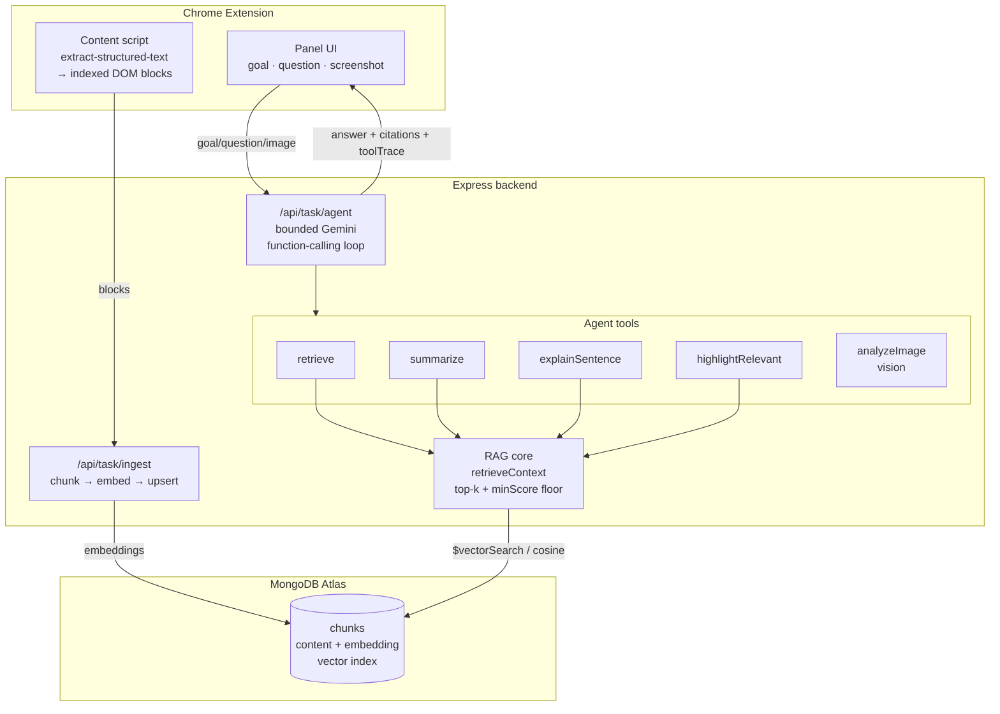

# Architecture

AI Reading Partner is a RAG-shaped reference application: a Chrome extension that
extracts the page you're reading, and a Gemini-powered backend that retrieves the
most relevant passages and answers — grounded, with citations — through a bounded
agent loop.

## Data flow

## The three honest claims

- **RAG-grounded text.** Text answers retrieve top-k passages (Gemini
  `text-embedding-004`, cosine similarity with a `minScore` floor) and generate
  using only that context, returning the source chunk indices as citations.
- **Bounded agent.** `/api/task/agent` runs a Gemini function-calling loop
  (`MAX_STEPS=5`) that plans → calls tools → observes → answers, with a full
  `toolTrace` for transparency.
- **Multimodal, flagged.** When a screenshot is attached, the agent can call
  `analyzeImage` (Gemini vision). Vision answers are flagged `source: 'vision'`
  and are deliberately NOT chunk-cited — text answers are RAG-grounded, visual
  answers are vision-sourced.

## Storage

Chunk embeddings live in a MongoDB Atlas `chunks` collection with a vector search
index (`docs/atlas-vector-index.json`). The store backend is selected by
`RAG_STORE=atlas|memory`; an in-memory cosine store is a drop-in fallback. Both
report **raw cosine** scores so the `minScore` floor is backend-agnostic.
